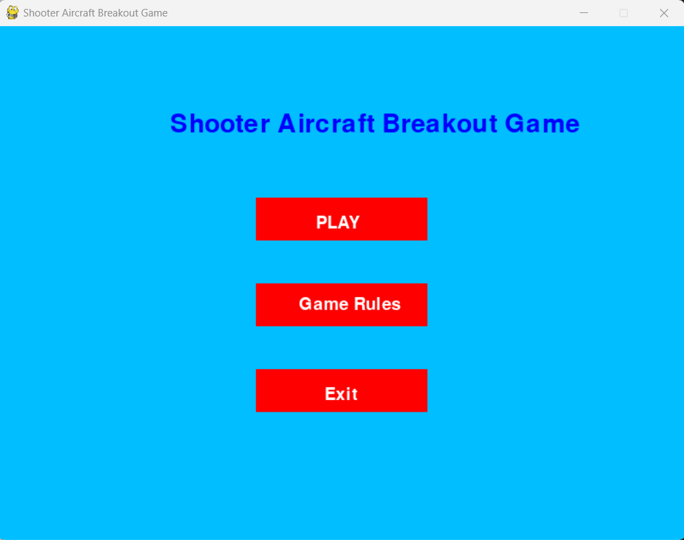
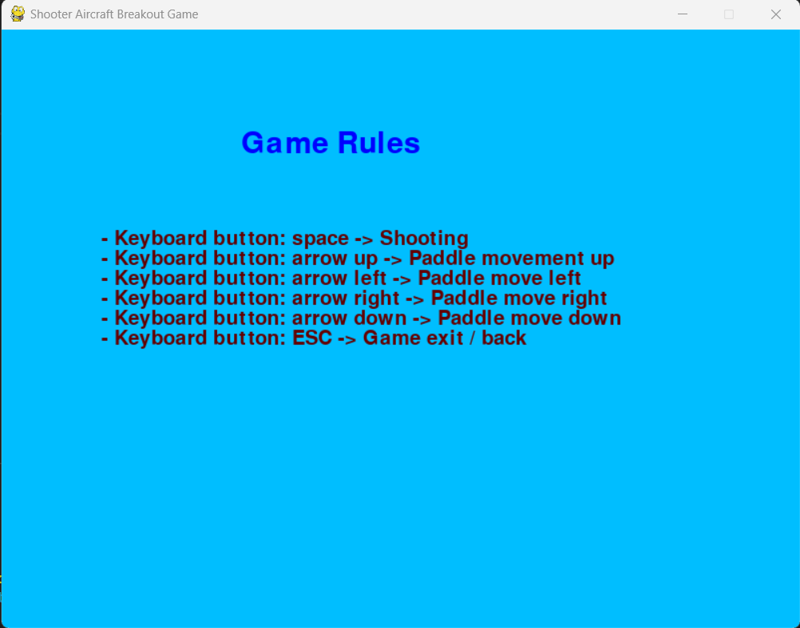
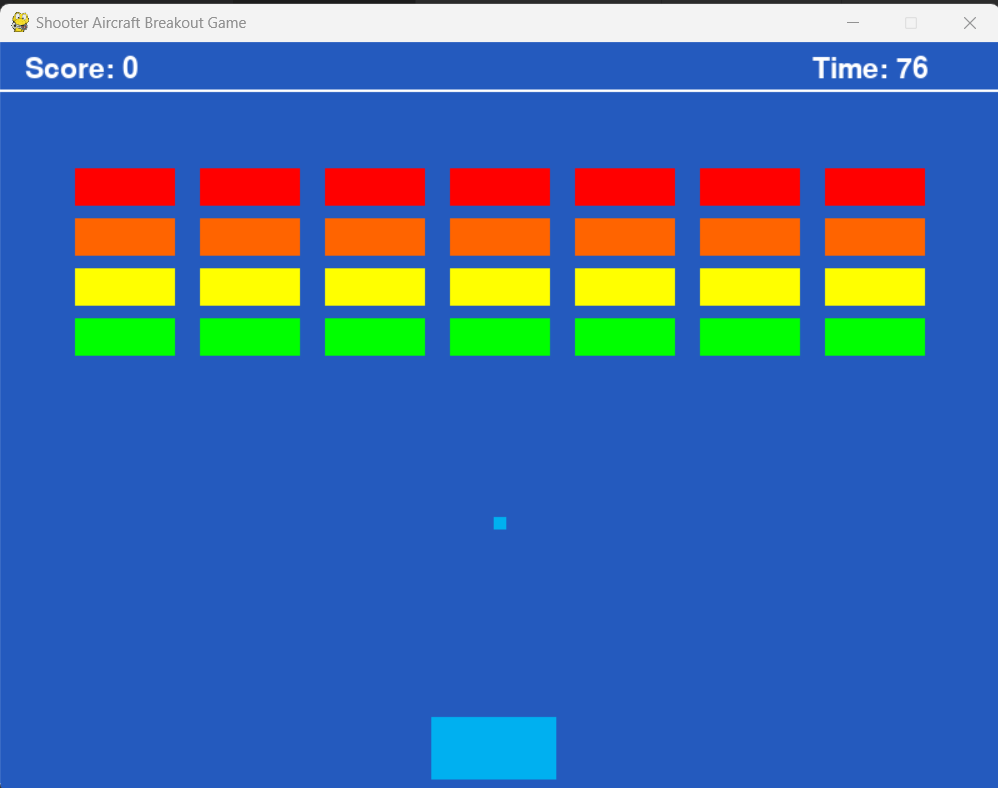
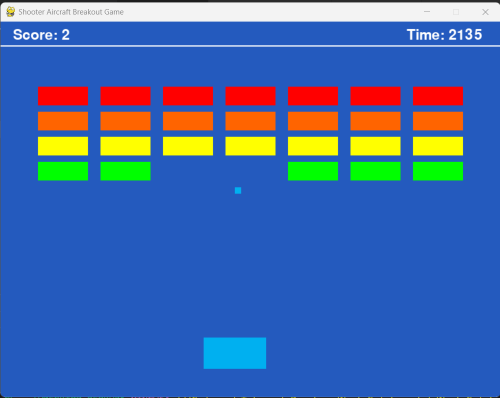
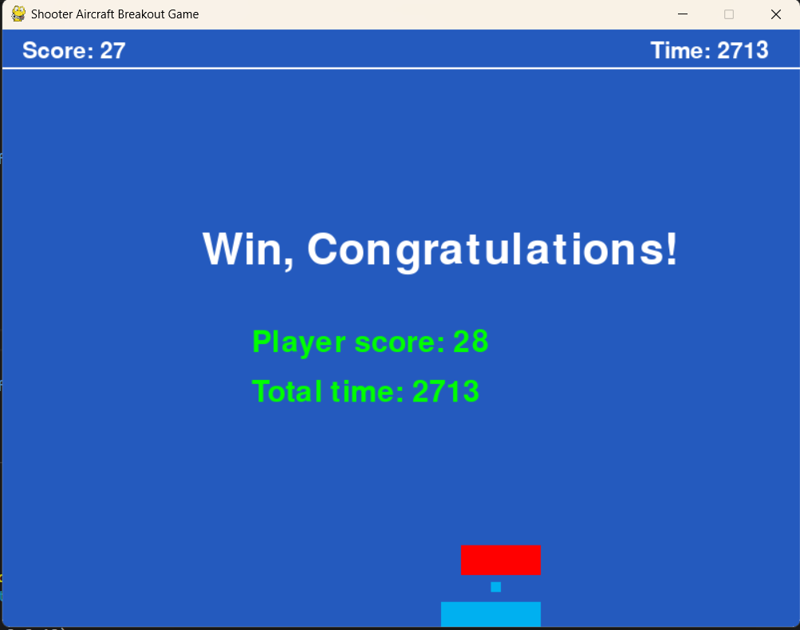
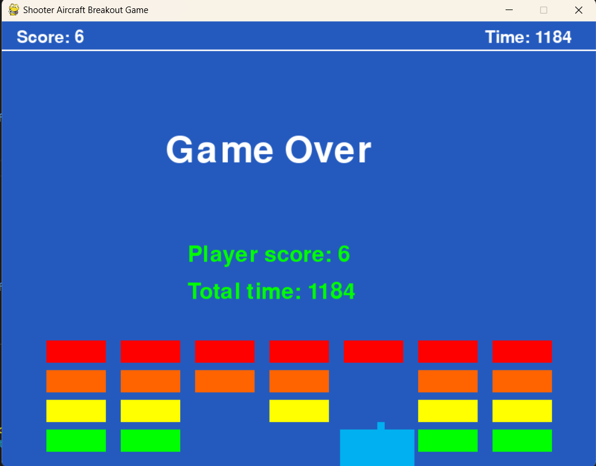

# Shooter-Aircraft-Game-using-PyGame-Library

## Outlines
- Introduction
- Game overview
- Game logic and rules
- Winning scenario
- Game over and termination

## Program structure
- main.py
- ball.py
- brick.py
- config.py
- game_menu.py
- paddle.py

Run the following command to start the game
```bash
python main.py
```
## Introduction
- The game was developed using the PyGame library
- The game consist of different elements such as paddle, bricks, and balls.
- The score is increased when a ball collides with a brick

## Game overview

- Starting window of the game console



- Select the *Game Rules* button for instruction



- Select the *PLAY* button for start playing


- Random scenario of the game 


- Winning of the game with score and time


- Lost and game over with score and time



